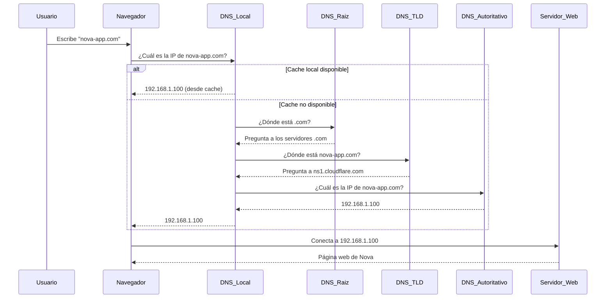

# Diagramas y Ilustraciones DNS

## Diagrama 1: Flujo de Resolución DNS



## Diagrama 2: Arquitectura DNS para Nova

```
┌─────────────────────────────────────────────────────────────┐
│                    ZONA DNS: nova-app.com                  │
├─────────────────────────────────────────────────────────────┤
│                                                             │
│  ┌─────────────────┐    ┌─────────────────┐                │
│  │ Registro A      │    │ Registro MX     │                │
│  │ nova-app.com    │────│ Priority: 10    │                │
│  │ → 192.168.1.100 │    │ mail.nova-app.com               │
│  └─────────────────┘    └─────────────────┘                │
│                                                             │
│  ┌─────────────────┐    ┌─────────────────┐                │
│  │ Registro CNAME  │    │ Registro TXT    │                │
│  │ www.nova-app.com│────│ SPF, DKIM       │                │
│  │ → nova-app.com  │    │ Verificaciones  │                │
│  └─────────────────┘    └─────────────────┘                │
│                                                             │
│  ┌─────────────────────────────────────────┐                │
│  │          SUBDOMINIOS                    │                │
│  │                                         │                │
│  │  api.nova-app.com    → 192.168.1.101   │                │
│  │  admin.nova-app.com  → 192.168.1.102   │                │
│  │  cdn.nova-app.com    → d123.cloudfront │                │
│  │  dev.nova-app.com    → 192.168.1.200   │                │
│  └─────────────────────────────────────────┘                │
└─────────────────────────────────────────────────────────────┘
```

## Diagrama 3: Flujo de Verificación de Email (SPF/DKIM/DMARC)

```
Email enviado desde Nova App
           │
           ▼
┌─────────────────────────┐
│ 1. Verificación SPF     │
│ ¿El servidor está       │
│ autorizado?             │
└─────────┬───────────────┘
          │
          ▼ ✓ PASS
┌─────────────────────────┐
│ 2. Verificación DKIM    │
│ ¿La firma digital es    │
│ válida?                 │
└─────────┬───────────────┘
          │
          ▼ ✓ PASS
┌─────────────────────────┐
│ 3. Política DMARC       │
│ ¿Qué hacer con el       │
│ resultado?              │
└─────────┬───────────────┘
          │
          ▼
┌─────────────────────────┐
│ Resultado:              │
│ • PASS → Bandeja entrada│
│ • FAIL → Spam/Rechazo   │
│ • QUARANTINE → Revisar  │
└─────────────────────────┘
```

## Diagrama 4: Configuración DNS por Ambiente

```
PRODUCCIÓN (nova-app.com)
├── Web Server: 192.168.1.100
├── API Server: 192.168.1.101  
├── Database: 192.168.1.105
└── CDN: cloudfront.net

STAGING (staging.nova-app.com)
├── Web Server: 192.168.1.201
├── API Server: 192.168.1.202
├── Database: 192.168.1.205
└── CDN: staging-cdn.amazonaws.com

DESARROLLO (dev.nova-app.com)
├── Web Server: localhost:5173
├── API Server: localhost:3000
├── Database: localhost:27017
└── Assets: localhost
```

## Ejemplo Visual: Propagación DNS

```
Cambio de DNS realizado
        │
        ▼
┌─────────────────┐     ┌─────────────────┐
│ Servidor DNS    │────▶│ ISP México      │ ⏰ 0-2 horas
│ Autoritativo    │     │ (Telmex, Izzi)  │
└─────────────────┘     └─────────────────┘
        │
        ▼               ┌─────────────────┐
┌─────────────────┐────▶│ ISP Estados     │ ⏰ 2-8 horas  
│ Cloudflare      │     │ Unidos          │
│ (Proveedor DNS) │     └─────────────────┘
└─────────────────┘
        │               ┌─────────────────┐
        └──────────────▶│ ISP Europa/Asia │ ⏰ 8-48 horas
                        │ (Más lejanos)   │
                        └─────────────────┘

TTL (Time To Live):
• 300 segundos = 5 minutos (cambios rápidos)
• 3600 segundos = 1 hora (normal)
• 86400 segundos = 24 horas (estable)
```